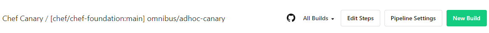

# Chef 16 Support for Chef Foundation

Package all of chef's omnibus dependencies for Chef 16 ahead of time so that when a chef omnibus build occurs, it will only need to install the chef gem (and gem dependencies) on top and repackage.

## Motivation

With the continuous releases and updates to [Chef](https://github.com/chef/chef) and [Chef Foundation](https://github.com/chef/chef-foundation), the goal is to provide long-term support for 2 previous major versions of Chef Foundation. This document outlines the steps that were taken to backport and maintain Chef major version 16, while being conscious of the CVE's present and using appropriate dependency versions to mitigate them and providing continuous support when new CVE's are discovered. 

## Backport Steps Taken

### Code Changes
The following steps were performed to backport the `main` branch of chef-foundation to support Chef 16:

* Clone the [chef-foundation](https://github.com/chef/chef-foundation/) repo and create a new branch labeled `chef-XX` where `XX` is the major version to support, in this case it will be `chef-16` 
* Comparing and importing the differences between the following files in the [Chef](https://github.com/chef/chef) repository, with priority going to the existing files in the `chef-16` branch of Chef:
	* [chef-foundation.rb](https://github.com/chef/chef-foundation/blob/main/config/projects/chef-foundation.rb) and [chef.rb](https://github.com/chef/chef/blob/chef-16/omnibus/config/projects/chef.rb)
		* See commits with changes [here](https://github.com/chef/chef-foundation/commit/16927b336090fc10ed51fe38a75744ce5811cf2d) and [here](https://github.com/chef/chef-foundation/commit/5b8071717889c51f1a82e41e42748df0005e2aa9)

* Adding the changes in [this PR](https://github.com/chef/chef-foundation/pull/34) to both the `main` branch as well as the `chef-16` branch so that the supported versions will build when changes are added to them

* Update the available platforms `.expeditor/adhoc-canary.omnibus.yml` (or similar omnibus pipeline yaml) to align with the test platforms supported by Chef 16. [See here for reference list](https://github.com/chef/chef/blob/main/.expeditor/adhoc-canary.omnibus.yml).

### Local Validation
Once the [code changes](#code-changes) are completed, local validation needs to be done. The summary of the validation is that there needs to be two docker images run, one for building the `.deb` package, the other for performing the installation from a clean image to emulate how it works on Buildkite.

> **! Important notes for validating on Windows !**

> *Pre-requisites:*
> This must be completed using both DockerHub and a WSL2 terminal instance.
> 
> * If you do not have DockerHub installed, follow [these instructions](https://docs.docker.com/desktop/install/windows-install/).
> * If you do not have WSL2 installed, follow [these instructions to install WSL2](https://learn.microsoft.com/en-us/windows/wsl/install) and [these instructions to configure it for docker](https://docs.docker.com/desktop/windows/wsl/). Make sure to download the matching linux distrobution to what you will be using in Buildkite (see Step 2 below for more details on this).
>
> *Line Endings:*
> Windows uses CRLF line endings, this causes issues with the installing the `.deb` package. See the section on `dos2unix` under the [Issues and Concerns](#issues-and-concerns-for-supporting-other-versions) section for more information and avoid this issue.


The steps to complete the validation are as follows:

1. Navigate to the root of the cloned `chef-foundation` project directory in your terminal instance.
2. These steps run a docker container that is using an image which falls under the [supported adhoc images listed here](https://github.com/chef/chef-foundation/blob/chef-16/.expeditor/adhoc-canary.omnibus.yml) and then builds the omnibus toolchain `.deb` file. 
	```
	docker run -it --privileged --volume $(pwd):/home chefes/omnibus-toolchain-ubuntu-2204 /bin/bash
	export PATH=/opt/omnibus-toolchain/bin:$PATH
	cd /home
	bundle install
	bundle exec omnibus build chef-foundation
	```
	* **Note:** For the sake of simplicity, this document will use `Ubuntu 2204` (falls under `ubuntu-*-x86_64` from the link above) as its base image for validation. For a different OS, replace the `ubuntu-2204` part of the command with the preferred image. See all [supported chefes/omnibus-toolchain images here](https://hub.docker.com/search?q=chefes/omnibus-toolchain).

3. Verify that the following files were created under the root project's directory in the `/pkg` directory:
	* `chef-foundation-{version}+{date}-{platform-data}.deb`
	* `chef-foundation-{version}+{date}-{platform-data}.metadata.json.deb`
	* `version-manifest.json`

4. To install the newly built `.deb` package, we need to launch a new container so it's a blank slate and behaves as a clean install. Replace the `{image-name}` part of the `pkg/chef-foundation-{image-name}.deb` below with the correct file name. After that is done, the commands to launch the new container and run the existing validation tests. If the tests run without any errors, then the validation is a success and the process can continue onto the next step for further validation.
	```
	docker run -it --privileged --volume $(pwd):/home chefes/omnibus-toolchain-ubuntu-2204 /bin/bash
	export PATH=/opt/omnibus-toolchain/bin:$PATH
	cd /home
	dpkg -i pkg/chef-foundation-{image-name}.deb
	./omnibus-tests.sh
	```

5. With local testing done, the next step is to run an Adhoc build in the Chef Canary Buildkite. The Chef Canary Buildkite instance does not have all the same available agents as the Chef Buildkite instance does, but it provides enough breadth of platforms to find issues early without muddying the core buildkite jobs. 

* The [Chef Canary Buildkite instance is located here](https://buildkite.com/chef-canary/chef-chef-foundation-main-omnibus-adhoc-canary). 
* Click `New Build` on the top-right of the page. 

* Fill out the following fields in the `New Build` dialog box:
	* *Message*: Add a description of the build name, something like `{branch-name}`, `{github-name}-{branch-name}-{short-description}`. (e.g. `gitusername-chef-16-adhoc-build`)
	* *Branch*: The branch the development was done on, in this case it was `chef-16`
	* *[Optional]* Environment Variables: You can add one environment variable that acts as filter to build a specific platforms so that if only one platform is having issues, it does not hog resources for something that is already working. The variable for this is: `OMNIBUS_FILTER` and can be used like this: `OMNIBUS_FILTER=windows*`


## Issues and Concerns for Supporting Other Versions

##### General Issues
* Older versions of Ruby (`<= 2.x`) cause build issues, and also have CVE's present. It is highly reccommended to use Ruby `>= 3.x`, which addresses both fixing the build issues and remedying the CVE's found in older versions of Ruby
	* Note: The version of Ruby must be supported by Omnibus, [see here for supported versions](https://github.com/chef/omnibus-software/blob/main/config/software/ruby.rb#L44)

##### Windows Specific Issues
If the backport development is happening on Windows, there are a couple concerns to be aware of:

* The building should be done in a WSL2 instance so that it can be run in a unix-based environment and a valid `.deb` file can be produced
* Depending on the configurations you have, WSL2 will use CRLF line endings, which breaks installing the generated `.deb`, this can be remedied in one of two ways
	* [preferred] using the cli tool `dos2unix` to fix the line endings so it is only LF endings instead of CRLF
	* extracting the package and using `fakeroot` to clean up line endings, then re-packaging the `.deb` before installing